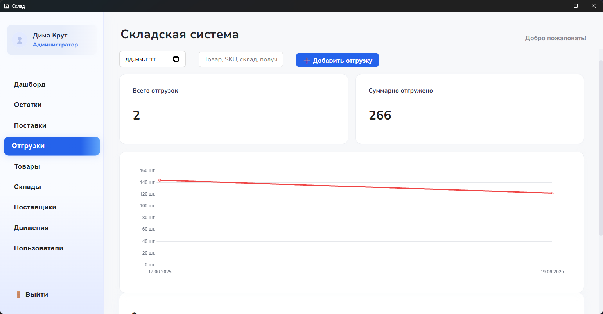

# :clipboard: Inventory App :clipboard:

[Русская версия](README.ru.md)

<!-- BADGES -->
<p align="center">
  
  
</p>

## :blue_book: About


Inventory App is a desktop inventory management system built with [**Wails**](https://wails.io/) and Vue. It lets you manage items, warehouses, suppliers and deliveries, track stock levels with interactive charts and handle user authentication with roles. Data can be exported to **Excel** and is stored in PostgreSQL.

## 🖼️ Gallery
Place additional screenshots in the `screenshots/` folder and they will appear here:





## :blue_book: Installation

### Prerequisites
- Go 1.24 or later
- Node.js 18 or later
- PostgreSQL

### Steps
1. Clone the repository and enter the project directory:
   ```bash
   git clone <repo-url>
   cd inventory-app-directory
   ```
2. Copy `.env.example` to `.env` and update the database settings.
3. Install the Wails CLI:
   ```bash
   go install github.com/wailsapp/wails/v2/cmd/wails@latest
   ```
4. Install frontend dependencies:
   ```bash
   cd frontend
   npm install
   cd ..
   ```
5. Apply the migrations to your PostgreSQL database:
   ```bash
   psql -d <dbname> -f migrations/001_init_schema.sql
   ```
6. Run the app in development mode:
   ```bash
   wails dev
   ```
   or build the production binary:
   ```bash
   wails build
   ```
   The binary will be located in `build/bin`.

## :moyai: Contributing
Feel free to open issues or pull requests.

