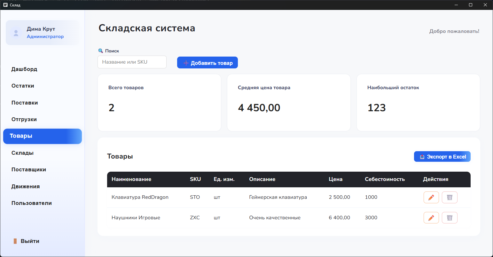

<h1 align="center"> :clipboard: Inventory App :clipboard: </h1>

<p align="center">
  
  
</p>

<p align="center">
  <a href="README_RU.md"></a>
</p>

## :blue_book: About


Inventory App is a desktop inventory management system powered by [**Wails**](https://wails.io/) and Vue. It lets you manage items, warehouses, suppliers and deliveries. Stock levels and movements are visualised with charts. The app supports role based authentication, Excel export and stores data in PostgreSQL.

## 🖼️ Gallery
Place additional screenshots in the `screenshots/` folder and they will appear here:




## :blue_book: Installation
1. **Install prerequisites**
   - [Go 1.21+](https://go.dev/dl/)
   - [Node.js 16+](https://nodejs.org/)
   Ensure the `go` and `npm` commands are available in your `PATH`.
2. **Install the Wails CLI**
   ```bash
   go install github.com/wailsapp/wails/v2/cmd/wails@latest
   ```
3. **Configure PostgreSQL**
   - Create a database and user.
   - Load `migrations/001_init_schema.sql` into your database.
   - Create a `.env` file with:
     ```
     DB_HOST=localhost
     DB_PORT=5432
     DB_USER=your_user
     DB_PASSWORD=your_password
     DB_NAME=inventory
     ```
4. **Install frontend dependencies**
   ```bash
   cd frontend && npm install
   ```
5. **Run the application**
   - Development mode: `wails dev`
   - Production build: `wails build` then run the binary from `build/bin`

## :moyai: Contributing
Feel free to open issues or pull requests.

---

