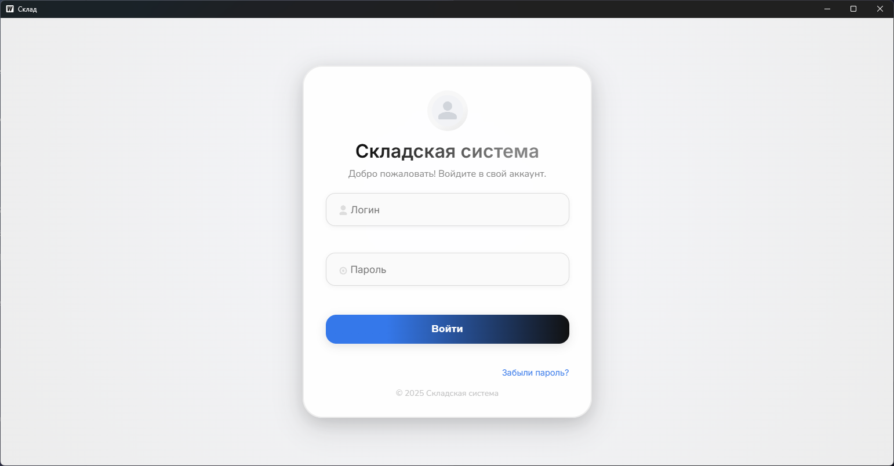
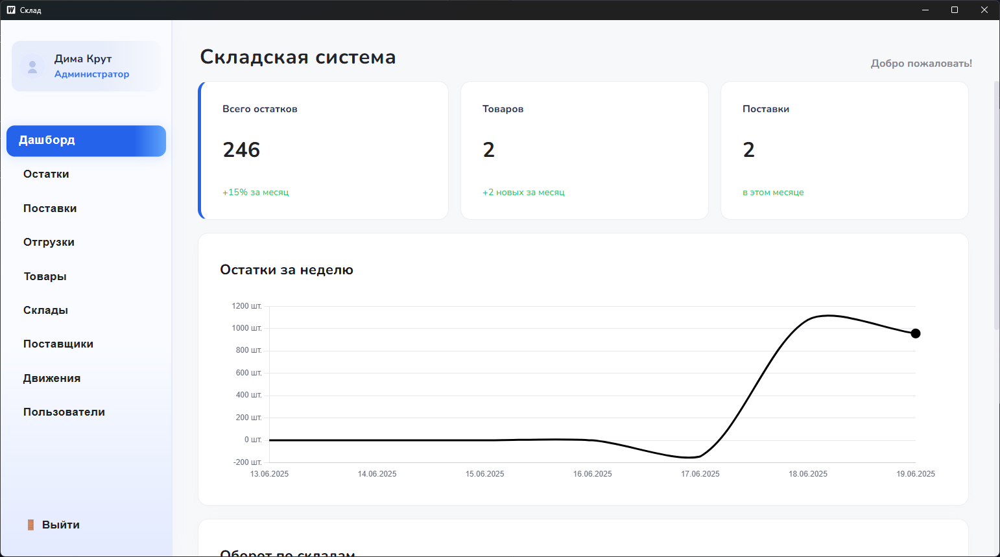
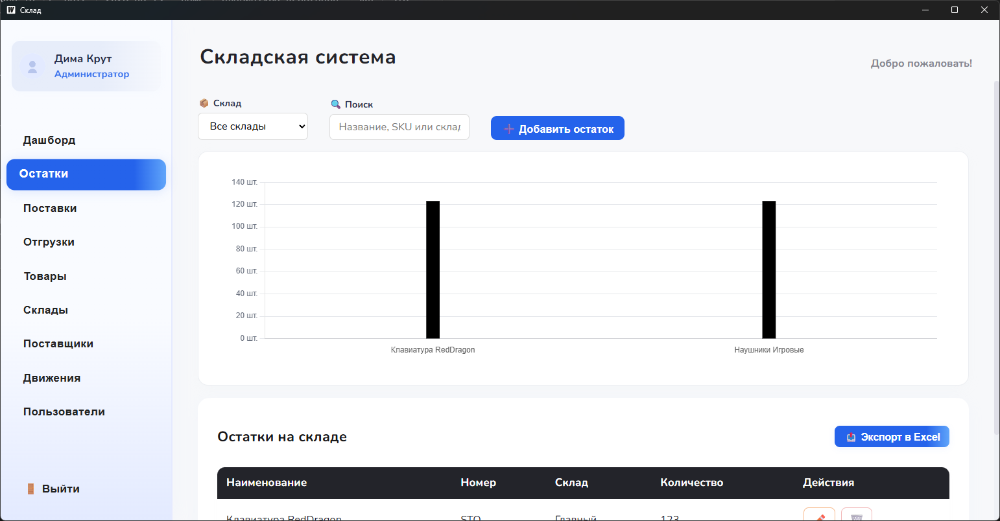
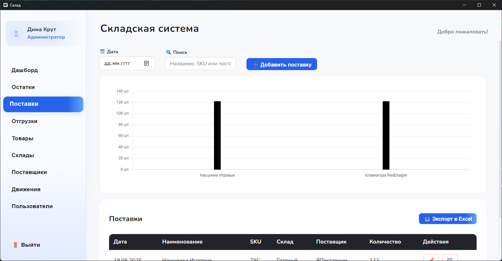
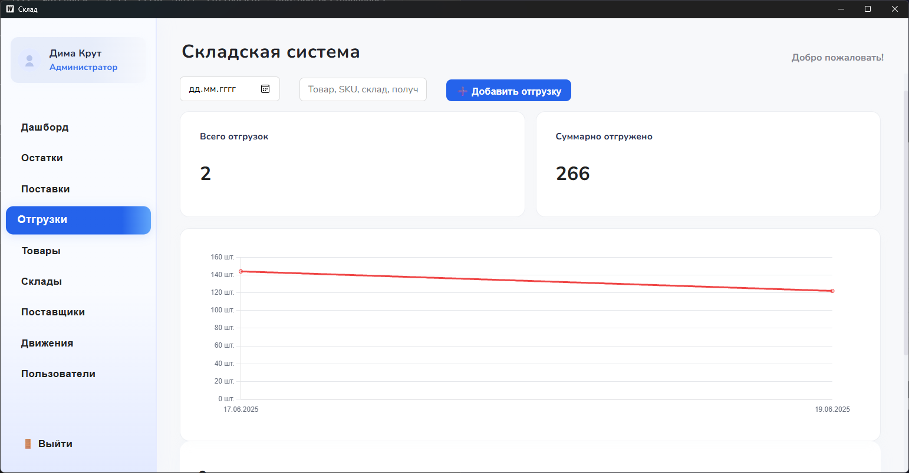
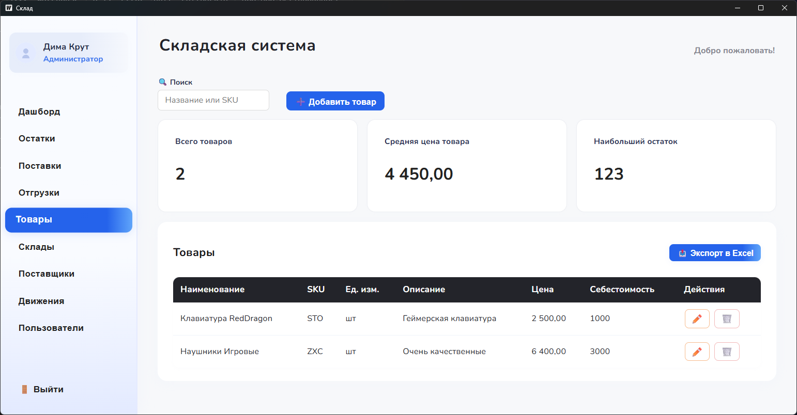

# :clipboard: Inventory App :clipboard:

<p align="center">
  <a href="README.md"></a>
</p>

## :blue_book: О приложении



**Inventory App** - это настольная система учёта, созданная на основе [**Wails**](https://wails.io/) и Vue. Приложение позволяет управлять товарами, складами, поставщиками и поставками. Количество и перемещение товаров отображается на графиках. Поддерживаются ролевая авторизация, экспорт в **Excel** и хранение данных в PostgreSQL.

## 🖼️ Галерея
Поместите дополнительные скриншоты в папку `screenshots/` и они появятся здесь:











## :blue_book: Установка
1. **Установите зависимости**
   - [Go 1.21+](https://go.dev/dl/)
   - [Node.js 16+](https://nodejs.org/)
2. **Установите Wails CLI**
   ```bash
   go install github.com/wailsapp/wails/v2/cmd/wails@latest
   ```
3. **Настройте PostgreSQL**
   - Создайте базу данных и пользователя.
   - Импортируйте схему из `migrations/001_init_schema.sql`.
   - Создайте файл `.env` со значениями:
     ```
     DB_HOST=localhost
     DB_PORT=5432
     DB_USER=your_user
     DB_PASSWORD=your_password
     DB_NAME=inventory
     ```
4. **Установите frontend-зависимости**
   ```bash
   cd frontend && npm install
   ```
5. **Запустите приложение**
   - Для разработки: `wails dev`
   - Для сборки: `wails build` и запуск бинарника из `build/bin`

## :moyai: Содействие
Открывайте issues и присылайте pull requests.
